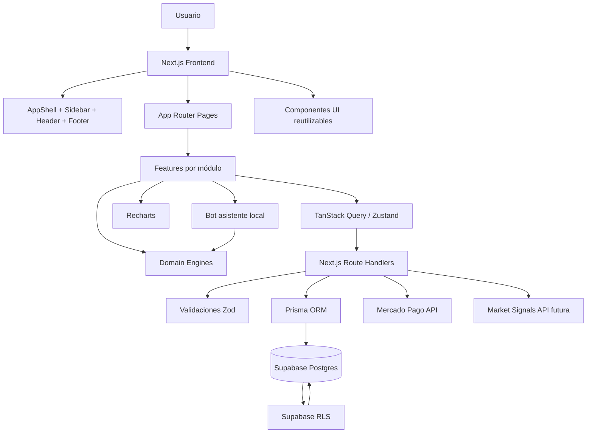
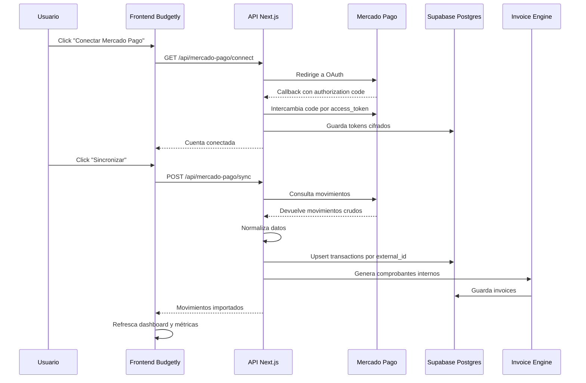
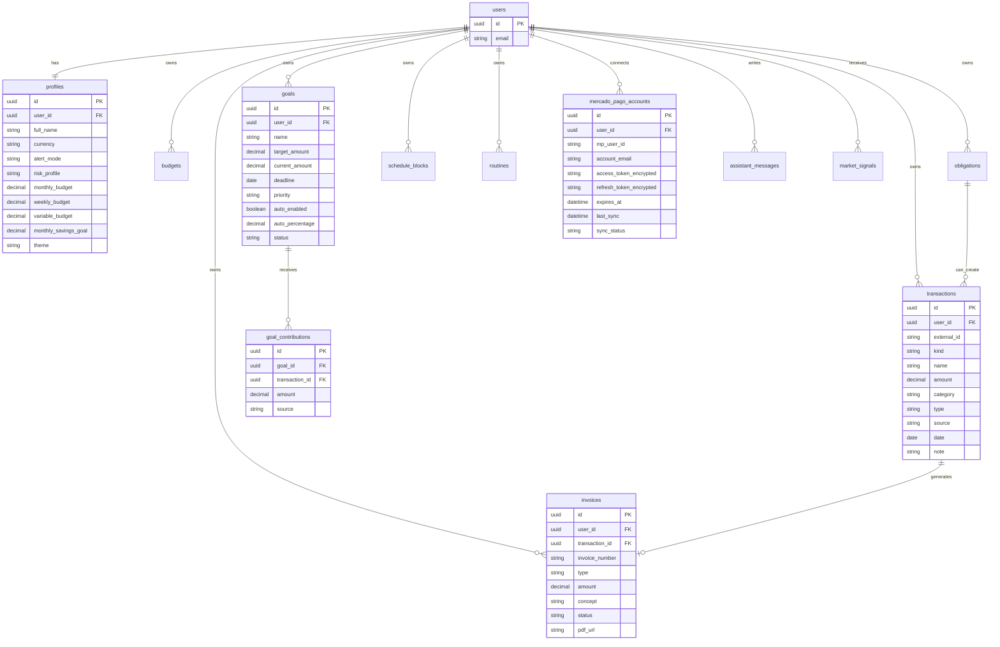

# Budgetly — Plan técnico y prompt para Codex dentro del IDE

## Contexto del proyecto

Repo actual:

```txt
https://github.com/DylanDev08/Budgetly
```

El proyecto se llama **Budgetly** y busca convertirse en una app web de finanzas personales con:

- Dashboard financiero.
- Control de ingresos.
- Control de gastos.
- Gastos fijos.
- Gastos variables.
- Gastos semanales.
- Presupuestos.
- Horarios y rutinas.
- Metas financieras.
- Bot asistente.
- Conexión con Mercado Pago.
- Generación de comprobantes/facturas internas.
- Análisis educativo de inversión.
- Footer legal.
- Backend + DB + Prisma + Supabase.

Actualmente la app ya tiene una base, pero hay varios puntos a mejorar:

- El fondo no está totalmente en negro.
- Falta estilo fintech oscuro tipo Lemon Cash.
- Los botones todavía son decorativos o no tienen funcionalidad real.
- Falta terminar backend.
- Falta conexión real a DB.
- Falta Prisma.
- Falta conectar el frontend con datos reales.
- Faltan links funcionales.
- Falta footer con términos legales y condiciones.
- Falta seguridad sólida.
- Falta modularizar mejor ciertas partes.
- Falta cerrar la experiencia visual y de usuario.

---

# Rol que debe asumir Codex

Actuá como:

```txt
Senior Full Stack Developer
Software Architect
UX/UI Designer especializado en fintech
Especialista en Next.js, Supabase, Prisma, APIs externas y seguridad
```

No quiero que reescribas todo el proyecto sin revisar.

Primero inspeccioná la estructura actual del repo y después aplicá cambios en fases chicas, limpias y controladas.

---

# Objetivo principal

Transformar **Budgetly** en una app financiera personal estilo fintech moderna, inspirada visualmente en apps como Lemon Cash, pero sin copiar marca ni assets.

La app debe tener:

- Fondo negro.
- Paleta verde fintech.
- Sidebar funcional.
- Dashboard interactivo.
- Botones reales.
- CRUD conectado a DB.
- Backend funcional.
- Prisma.
- Supabase.
- Mercado Pago preparado.
- Footer legal.
- Rutas protegidas.
- Seguridad real.
- Código modular, escalable y mantenible.

---

# Stack tecnológico requerido

Usar y consolidar este stack:

```txt
Frontend:
- Next.js
- TypeScript
- Tailwind CSS
- React
- Recharts
- Framer Motion
- Lucide React
- React Hook Form
- Zod
- TanStack Query
- Zustand o Context/useReducer si ya está en uso

Backend:
- Next.js Route Handlers
- Supabase
- Prisma ORM
- PostgreSQL vía Supabase

Auth:
- Supabase Auth

DB:
- Supabase Postgres

Seguridad:
- Supabase RLS
- Zod validation
- Middleware de rutas protegidas
- Variables de entorno
- Tokens seguros en backend

APIs:
- Mercado Pago OAuth
- Mercado Pago movements/sync
- Market service mock para inversión educativa
```

---

# Paleta visual requerida

El diseño debe cambiar a un estilo **dark fintech**, tipo Lemon Cash.

## Colores

```txt
Fondo principal: #050A06
Fondo secundario: #0B120D
Cards: #101914
Cards hover: #142119
Bordes: rgba(34, 197, 94, 0.18)

Verde principal: #22C55E
Verde neón: #39FF88
Verde oscuro: #166534

Texto principal: #F8FAFC
Texto secundario: #94A3B8
Texto apagado: #64748B

Warning: #F59E0B
Error: #EF4444
Success: #22C55E
```

## Estilo

```txt
- Fondo negro total.
- Sidebar oscura.
- Cards oscuras con borde verde sutil.
- Botones verdes funcionales.
- Métricas grandes y claras.
- Hover suave.
- Gráficos en verde/blanco.
- Inputs oscuros.
- Tablas oscuras.
- Badges claros.
- Estados visuales: correcto, advertencia, crítico.
- Footer legal visible.
- No usar fondos blancos salvo que sea estrictamente necesario.
- No usar gradientes exagerados.
- No usar apariencia genérica de IA.
```

---

# Arquitectura modular esperada

La estructura final sugerida debe quedar parecida a esta:

```txt
src/
  app/
    layout.tsx
    page.tsx
    globals.css

    dashboard/
      page.tsx

    movements/
      page.tsx

    budgets/
      page.tsx

    obligations/
      page.tsx

    schedule/
      page.tsx

    routines/
      page.tsx

    goals/
      page.tsx

    investments/
      page.tsx

    assistant/
      page.tsx

    mercado-pago/
      page.tsx

    invoices/
      page.tsx

    settings/
      page.tsx

    legal/
      terms/
        page.tsx
      privacy/
        page.tsx
      security/
        page.tsx

    auth/
      login/
        page.tsx
      register/
        page.tsx

    api/
      mercado-pago/
        connect/
          route.ts
        callback/
          route.ts
        sync/
          route.ts
        movements/
          route.ts

      invoices/
        route.ts

      market/
        signals/
          route.ts

  components/
    layout/
      AppShell.tsx
      Sidebar.tsx
      Header.tsx
      Footer.tsx
      MobileNav.tsx

    ui/
      Button.tsx
      Card.tsx
      Input.tsx
      Select.tsx
      Badge.tsx
      Modal.tsx
      StatCard.tsx
      PageHeader.tsx
      ConfirmDialog.tsx
      EmptyState.tsx
      LoadingState.tsx
      ErrorState.tsx

  features/
    dashboard/
      FinancialOverview.tsx
      SpendingChart.tsx
      RecentMovements.tsx
      GoalSummary.tsx
      FinancialHealth.tsx
      BudgetSummary.tsx

    movements/
      MovementForm.tsx
      MovementList.tsx
      MovementFilters.tsx
      MovementItem.tsx

    budgets/
      BudgetEditor.tsx
      BudgetCard.tsx
      BudgetAlert.tsx

    obligations/
      ObligationForm.tsx
      ObligationList.tsx
      ObligationItem.tsx

    schedule/
      WeeklyCalendar.tsx
      ScheduleForm.tsx

    routines/
      RoutineForm.tsx
      RoutineList.tsx
      RoutineItem.tsx

    goals/
      GoalForm.tsx
      GoalCard.tsx
      GoalAutomationPanel.tsx
      GoalProgress.tsx

    investments/
      InvestmentSummary.tsx
      RiskProfileCard.tsx
      InvestmentRecommendation.tsx
      InvestmentSignalCard.tsx

    assistant/
      AssistantChat.tsx
      AssistantMessage.tsx
      AssistantSuggestions.tsx

    mercadoPago/
      MercadoPagoConnectionCard.tsx
      MercadoPagoSyncPanel.tsx
      ImportedMovementsList.tsx

    invoices/
      InvoiceList.tsx
      InvoicePreview.tsx
      InvoiceItem.tsx

    settings/
      UserSettingsForm.tsx
      AppearanceSettings.tsx
      AlertModeSettings.tsx
      AccountSettings.tsx

  lib/
    prisma.ts

    supabase/
      client.ts
      server.ts
      middleware.ts

    services/
      mercadoPago.service.ts
      mercadoPagoOAuth.service.ts
      invoice.service.ts
      market.service.ts
      assistant.service.ts
      transaction.service.ts
      budget.service.ts
      goal.service.ts

    domain/
      financeCalculations.ts
      budgetEngine.ts
      roastEngine.ts
      goalEngine.ts
      invoiceEngine.ts
      investmentEngine.ts
      assistantEngine.ts

    validations/
      transaction.schema.ts
      goal.schema.ts
      obligation.schema.ts
      settings.schema.ts
      budget.schema.ts

    utils/
      money.ts
      dates.ts
      id.ts
      cn.ts

  prisma/
    schema.prisma
    migrations/

  types/
    finance.ts
    mercadoPago.ts
    database.ts
```

---

# Sidebar requerida

La sidebar debe estar a la izquierda y tener links funcionales hacia:

```txt
- Dashboard
- Movimientos
- Presupuestos
- Obligaciones
- Horarios
- Rutinas
- Metas
- Inversión
- Bot asistente
- Mercado Pago
- Facturas / Comprobantes
- Ajustes
```

La sidebar debe incluir:

```txt
- Logo/nombre Budgetly
- Estado activo visible
- Íconos
- Botones o links funcionales
- Responsive mobile
- Footer pequeño con copyright
```

---

# Footer legal requerido

Crear footer funcional con links a:

```txt
/legal/terms
/legal/privacy
/legal/security
```

También incluir:

```txt
- Contacto
- Copyright
- Nombre de la app
- Versión opcional
```

Crear páginas básicas:

```txt
src/app/legal/terms/page.tsx
src/app/legal/privacy/page.tsx
src/app/legal/security/page.tsx
```

---

# Diagrama de arquitectura web



---

# Diagrama de flujo de Mercado Pago



---

# Diagrama de flujo de la DB



---

# Prisma schema sugerido

Crear o actualizar:

```txt
prisma/schema.prisma
```

Contenido sugerido:

```prisma
generator client {
  provider = "prisma-client-js"
}

datasource db {
  provider = "postgresql"
  url      = env("DATABASE_URL")
}

model Profile {
  id                 String   @id @default(uuid())
  userId             String   @unique @map("user_id")
  fullName           String?  @map("full_name")
  email              String
  currency           String   @default("ARS")
  alertMode          String   @default("normal") @map("alert_mode")
  riskProfile        String   @default("conservador") @map("risk_profile")
  monthlyBudget      Decimal  @default(0) @map("monthly_budget")
  weeklyBudget       Decimal  @default(0) @map("weekly_budget")
  variableBudget     Decimal  @default(0) @map("variable_budget")
  monthlySavingsGoal Decimal  @default(0) @map("monthly_savings_goal")
  theme              String   @default("dark")
  createdAt          DateTime @default(now()) @map("created_at")
  updatedAt          DateTime @updatedAt @map("updated_at")

  @@map("profiles")
}

model Transaction {
  id         String   @id @default(uuid())
  userId     String   @map("user_id")
  externalId String?  @map("external_id")
  kind       String
  name       String
  amount     Decimal
  category   String
  type       String
  source     String   @default("manual")
  date       DateTime
  note       String?
  invoiceId  String?  @map("invoice_id")
  createdAt  DateTime @default(now()) @map("created_at")
  updatedAt  DateTime @updatedAt @map("updated_at")

  invoice Invoice?

  @@unique([userId, externalId])
  @@index([userId, date])
  @@index([userId, category])
  @@map("transactions")
}

model Invoice {
  id            String      @id @default(uuid())
  userId        String      @map("user_id")
  transactionId String      @unique @map("transaction_id")
  invoiceNumber String      @unique @map("invoice_number")
  type          String
  date          DateTime
  amount        Decimal
  concept       String
  category      String
  source        String
  status        String      @default("generada")
  pdfUrl        String?     @map("pdf_url")
  createdAt     DateTime    @default(now()) @map("created_at")

  transaction Transaction @relation(fields: [transactionId], references: [id])

  @@index([userId, date])
  @@map("invoices")
}

model Budget {
  id              String   @id @default(uuid())
  userId          String   @map("user_id")
  name            String
  category        String?
  type            String
  limitAmount     Decimal  @map("limit_amount")
  alertPercentage Int      @default(80) @map("alert_percentage")
  createdAt       DateTime @default(now()) @map("created_at")
  updatedAt       DateTime @updatedAt @map("updated_at")

  @@index([userId])
  @@map("budgets")
}

model Obligation {
  id                    String   @id @default(uuid())
  userId                String   @map("user_id")
  name                  String
  amount                Decimal
  category              String
  frequency             String
  dueDay                Int      @map("due_day")
  status                String   @default("pendiente")
  autoCreateTransaction Boolean  @default(false) @map("auto_create_transaction")
  createdAt             DateTime @default(now()) @map("created_at")
  updatedAt             DateTime @updatedAt @map("updated_at")

  @@index([userId, dueDay])
  @@map("obligations")
}

model Goal {
  id             String   @id @default(uuid())
  userId         String   @map("user_id")
  name           String
  targetAmount   Decimal  @map("target_amount")
  currentAmount  Decimal  @default(0) @map("current_amount")
  deadline       DateTime?
  priority       String   @default("media")
  autoEnabled    Boolean  @default(false) @map("auto_enabled")
  autoPercentage Decimal  @default(0) @map("auto_percentage")
  status         String   @default("activa")
  createdAt      DateTime @default(now()) @map("created_at")
  updatedAt      DateTime @updatedAt @map("updated_at")

  contributions GoalContribution[]

  @@index([userId, status])
  @@map("goals")
}

model GoalContribution {
  id            String   @id @default(uuid())
  goalId        String   @map("goal_id")
  transactionId String?  @map("transaction_id")
  amount        Decimal
  source        String
  createdAt     DateTime @default(now()) @map("created_at")

  goal Goal @relation(fields: [goalId], references: [id])

  @@map("goal_contributions")
}

model ScheduleBlock {
  id        String   @id @default(uuid())
  userId    String   @map("user_id")
  day       String
  startTime String   @map("start_time")
  endTime   String   @map("end_time")
  activity  String
  area      String
  createdAt DateTime @default(now()) @map("created_at")
  updatedAt DateTime @updatedAt @map("updated_at")

  @@index([userId, day])
  @@map("schedule_blocks")
}

model Routine {
  id        String   @id @default(uuid())
  userId    String   @map("user_id")
  name      String
  frequency String
  done      Boolean  @default(false)
  streak    Int      @default(0)
  createdAt DateTime @default(now()) @map("created_at")
  updatedAt DateTime @updatedAt @map("updated_at")

  @@index([userId])
  @@map("routines")
}

model MercadoPagoAccount {
  id                    String   @id @default(uuid())
  userId                String   @map("user_id")
  mpUserId              String?  @map("mp_user_id")
  accountEmail          String?  @map("account_email")
  accessTokenEncrypted  String   @map("access_token_encrypted")
  refreshTokenEncrypted String   @map("refresh_token_encrypted")
  expiresAt             DateTime @map("expires_at")
  lastSync              DateTime? @map("last_sync")
  syncStatus            String   @default("idle") @map("sync_status")
  createdAt             DateTime @default(now()) @map("created_at")
  updatedAt             DateTime @updatedAt @map("updated_at")

  @@unique([userId])
  @@map("mercado_pago_accounts")
}

model AssistantMessage {
  id        String   @id @default(uuid())
  userId    String   @map("user_id")
  role      String
  content   String
  createdAt DateTime @default(now()) @map("created_at")

  @@index([userId, createdAt])
  @@map("assistant_messages")
}

model MarketSignal {
  id         String   @id @default(uuid())
  userId     String   @map("user_id")
  asset      String
  signalType String   @map("signal_type")
  riskLevel  String   @map("risk_level")
  summary    String
  createdAt  DateTime @default(now()) @map("created_at")

  @@index([userId])
  @@map("market_signals")
}
```

---

# Seguridad requerida

## Frontend

```txt
- Proteger rutas privadas.
- Redirigir a /auth/login si no hay sesión.
- No mostrar service role key.
- No mostrar tokens de Mercado Pago.
- Validar formularios con Zod.
- ConfirmDialog antes de borrar.
- Estados de loading/error.
- Mensajes de error genéricos.
```

## Backend

```txt
- Route Handlers solo para usuarios autenticados.
- Obtener userId desde Supabase Auth, nunca desde el body.
- Validar todos los payloads con Zod.
- Rate limit en endpoints sensibles.
- Logs sin tokens.
- Tokens de Mercado Pago cifrados.
- No hardcodear secretos.
```

## DB / Supabase

```txt
- RLS activado en todas las tablas.
- Policies por auth.uid().
- Índices por user_id.
- Unique user_id + external_id en transactions.
- Service role solo en backend.
- Migraciones controladas.
```

## Mercado Pago

```txt
- OAuth por backend.
- access_token y refresh_token cifrados.
- Refresh automático si expira.
- Deduplicación por external_id.
- Sincronización manual primero.
- Sincronización automática después.
- No guardar datos innecesarios.
```

## Inversión

```txt
- No ejecutar compras/ventas automáticas.
- Solo recomendaciones educativas.
- Pedir confirmación manual.
- Advertir si hay obligaciones pendientes o presupuesto excedido.
```

---

# Diseño requerido por sección

## Dashboard

```txt
- Fondo negro.
- Cards de métricas: ingresos, gastos, balance, salud financiera.
- Gráficos oscuros con verde.
- Últimos movimientos.
- Próximas obligaciones.
- Estado Mercado Pago.
- CTA verde: “Cargar movimiento”.
```

## Movimientos

```txt
- Formulario oscuro.
- Botones funcionales:
  - Crear ingreso.
  - Crear gasto.
  - Editar.
  - Eliminar.
  - Filtrar.
  - Buscar.
- Tabla/card list con badges:
  - manual / mercado_pago.
  - income / expense.
```

## Presupuestos

```txt
- Presupuesto mensual total.
- Límite semanal.
- Límite por categoría.
- Alertas al 80%, 100%, 120%.
- Respetar modo de alerta del usuario.
```

## Obligaciones

```txt
- Servicios.
- Suscripciones.
- Cuotas.
- Deudas.
- Pagos recurrentes.
- Estado pendiente/pagado.
- Si se marca como pagado:
  - Crear egreso.
  - Crear comprobante.
```

## Horarios y rutinas

```txt
- Agenda semanal.
- Cards por día.
- Rutinas con checkbox.
- Estadísticas de cumplimiento.
```

## Metas

```txt
- Crear metas financieras.
- Progreso.
- Fecha límite opcional.
- Prioridad.
- Aporte automático sugerido.
- No restar dinero de la meta de forma confusa.
```

## Bot asistente

```txt
- Chat local.
- Respuestas por reglas.
- No inventar datos.
- Usar movimientos, budgets, obligaciones, metas y horarios.
```

## Mercado Pago

```txt
- Card de conexión.
- Conectado / no conectado.
- Botón conectar.
- Botón sincronizar.
- Última sync.
- Movimientos importados.
```

## Facturas / comprobantes

```txt
- Cada movimiento genera comprobante interno.
- No es factura legal AFIP inicialmente.
- Debe tener:
  - Número.
  - Tipo.
  - Fecha.
  - Concepto.
  - Monto.
  - Categoría.
  - Origen.
  - Estado.
```

---

# Orden de implementación

Codex debe trabajar en fases:

## Fase 1 — Auditoría y diseño visual

```txt
1. Inspeccionar estructura actual.
2. Identificar archivos de layout y estilos.
3. Aplicar dark theme fintech negro + verde.
4. Corregir botones visualmente.
5. Crear AppShell, Sidebar, Header y Footer si no existen.
6. Crear páginas legales.
```

## Fase 2 — Supabase + Prisma

```txt
1. Configurar Prisma.
2. Crear schema.prisma.
3. Configurar DATABASE_URL.
4. Crear prisma client en src/lib/prisma.ts.
5. Crear migraciones.
6. Verificar conexión con Supabase.
```

## Fase 3 — Auth y perfiles

```txt
1. Supabase Auth.
2. Middleware de rutas privadas.
3. Profile por usuario.
4. Settings por usuario.
5. RLS en Supabase.
```

## Fase 4 — Movimientos + facturas

```txt
1. CRUD de movimientos.
2. Validaciones Zod.
3. Crear invoice automáticamente.
4. Dashboard consume datos reales.
```

## Fase 5 — Presupuestos y obligaciones

```txt
1. CRUD budgets.
2. CRUD obligations.
3. Marcar obligación como pagada.
4. Crear egreso + invoice.
```

## Fase 6 — Horarios, rutinas y metas

```txt
1. CRUD schedule_blocks.
2. CRUD routines.
3. CRUD goals.
4. Goal engine.
```

## Fase 7 — Bot asistente

```txt
1. Assistant engine local.
2. Chat UI.
3. Respuestas basadas en datos reales.
```

## Fase 8 — Mercado Pago mock

```txt
1. Pantalla de conexión.
2. Mock sync.
3. Normalizar movimientos.
4. Evitar duplicados.
```

## Fase 9 — Mercado Pago real

```txt
1. OAuth.
2. Tokens cifrados.
3. Refresh token.
4. Sync real.
5. Guardar movimientos.
6. Generar invoices.
```

## Fase 10 — Inversión educativa

```txt
1. Investment engine.
2. Market service mock.
3. Recomendaciones.
4. No ejecutar inversiones.
```

---

# Prompt corto para ejecutar en Codex

Usar este bloque si querés darle una instrucción directa:

```txt
Inspeccioná el proyecto actual Budgetly. No borres archivos sin revisar. El repo ya usa Next.js, TypeScript, Tailwind, Supabase, TanStack Query, Zustand, Zod, Recharts y Framer Motion.

Necesito transformar la app en una fintech personal estilo Lemon Cash, con fondo negro, verde financiero/neón, cards oscuras, sidebar funcional, dashboard interactivo, botones funcionales, footer legal, conexión real a Supabase DB con Prisma y arquitectura modular.

Objetivos:
1. Cambiar todo el diseño a dark fintech: fondo #050A06, cards #101914, verde principal #22C55E, verde neón #39FF88, texto #F8FAFC.
2. Mantener arquitectura modular: app, components, features, lib, types, prisma.
3. Crear AppShell con Sidebar, Header y Footer.
4. Sidebar con links funcionales: Dashboard, Movimientos, Presupuestos, Obligaciones, Horarios, Rutinas, Metas, Inversión, Bot asistente, Mercado Pago, Facturas, Ajustes.
5. Footer con links funcionales a /legal/terms, /legal/privacy, /legal/security y contacto.
6. Crear páginas legales básicas.
7. Conectar Supabase client/server correctamente.
8. Crear Prisma schema con tablas: Profile, Transaction, Budget, Obligation, Goal, GoalContribution, ScheduleBlock, Routine, Invoice, MercadoPagoAccount, AssistantMessage, MarketSignal.
9. Activar enfoque de seguridad: no exponer tokens, usar env vars, validar con Zod, proteger rutas, preparar RLS, evitar duplicados por userId + externalId.
10. Crear CRUD real de movimientos conectado a DB.
11. Cada movimiento debe generar un comprobante interno Invoice.
12. Dashboard debe consumir métricas reales desde DB: ingresos, gastos, balance, categoría top, últimos movimientos, estado de presupuesto.
13. Botones deben dejar de ser decorativos y tener acción real o estado disabled con explicación.
14. Mercado Pago primero mock funcional; después dejar estructura OAuth preparada.
15. No implementar inversión automática. Solo módulo educativo con recomendaciones.

Antes de modificar:
- Mostrame un resumen de archivos actuales relevantes.
- Explicá qué vas a tocar.
- Después implementá en fases pequeñas.
```

---

# Variables de entorno esperadas

Crear o actualizar `.env.example`:

```env
NEXT_PUBLIC_SUPABASE_URL=
NEXT_PUBLIC_SUPABASE_ANON_KEY=
SUPABASE_SERVICE_ROLE_KEY=

DATABASE_URL=
DIRECT_URL=

MERCADO_PAGO_CLIENT_ID=
MERCADO_PAGO_CLIENT_SECRET=
MERCADO_PAGO_REDIRECT_URI=
MERCADO_PAGO_WEBHOOK_SECRET=

APP_URL=http://localhost:3000
ENCRYPTION_SECRET=
```

---

# Reglas finales para Codex

```txt
- No crear código muerto.
- No dejar botones sin acción.
- Si una acción aún no existe, mostrar disabled + tooltip/explicación.
- No hardcodear datos sensibles.
- No romper imports existentes.
- No cambiar todo de golpe.
- Trabajar por fases.
- Explicar qué archivos se tocaron.
- Mantener TypeScript estricto.
- Validar con Zod.
- Usar Prisma para DB.
- Usar Supabase Auth para usuario.
- Usar RLS para seguridad.
- No usar tokens de Mercado Pago en frontend.
- No ejecutar inversiones automáticas.
- Mantener diseño oscuro y verde en toda la app.
```
